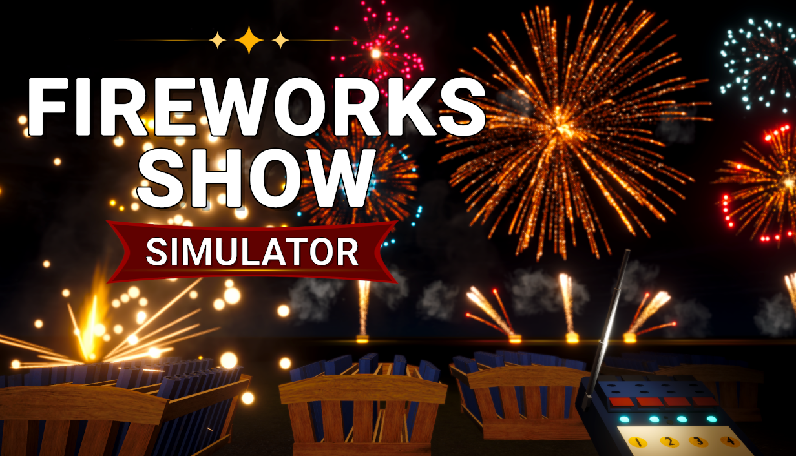
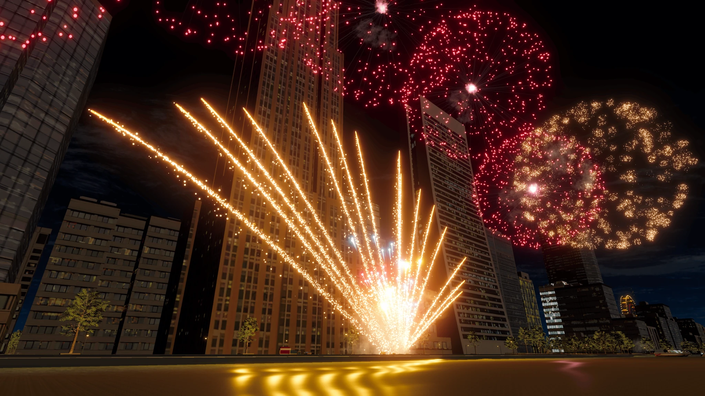

# Fireworks Show Simulator

Design professional fireworks displays from a top-down view. Watch your show from
any viewpoint in a fully 3D world. Place racks, load shells, connect fuses, and
control the firing system.

[Visit the Website](https://fireworksshowsimulator.com) |
[Wishlist on Steam](https://store.steampowered.com/app/4668450/Fireworks_Show_Simulator)

## Build Your Show

- **Place** racks, modules, and tubes to create your layout.
- **Load** shells and combine different firework effects.
- **Link** fuses and firing modules to connect your display.
- **Save** layouts and firing setups.
- **Watch** your show in free camera or fly mode.

## Explore the Website

Watch the trailer, browse gameplay screenshots, and explore the rack and shell
catalogs. Discover different rack configurations and effects, from comets and
mines to rings, brocades, peonies, and multi-break shells.

## Follow Simplay Studio

[YouTube](https://www.youtube.com/@simplaystudio) |
[TikTok](https://www.tiktok.com/@fireworksplayofficial) |
[Discord](https://discord.gg/2XXRJAEUtp)

Contact: [contact@simplaystudio.com](mailto:contact@simplaystudio.com)
